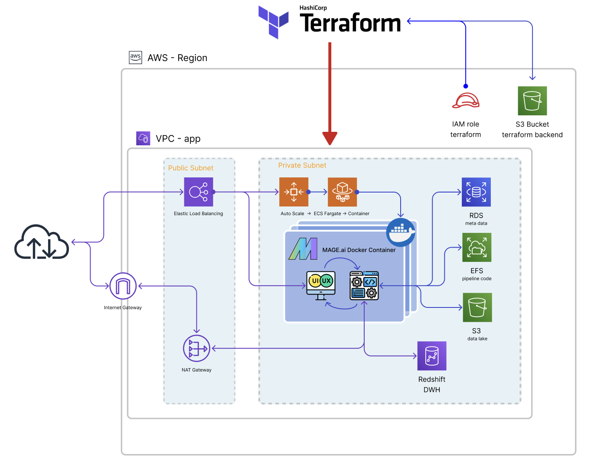

# Energy maket insights
### Analysis of electricity production in Germany

## Problem

In Europe, transitioning to renewable energy sources is crucial for meeting climate goals. However, there is a lack of clear, timely visibility into the shares of renewable versus fossil fuel energy sources in electricity production. This gap makes it difficult to effectively assess and manage progress toward a more sustainable energy supply. A detailed understanding of the current landscape of energy production in real-time is necessary to support policy and economic decisions that promote renewable energy use and reduce dependence on fossil fuels.

## Introduction

The **Energy Market Insights** project tackles the challenge of streamlining data management for European energy production metrics by deploying a sophisticated data engineering pipeline. Using "mage.ai" for orchestration within a Docker container, this system automates the ETL (extract, transform, load) processes required to analyze energy data. Managed via Terraform on AWS, the infrastructure is ready to use in a few clicks and supports a seamless data flow from extraction from the [ENTSO-E](https://transparency.entsoe.eu/) API to storage in a Redshift data warehouse. From this data, it is now possible to provide graphical and understandable insights into the data situation.

Data cource: https://transparency.entsoe.eu/


## Table of Contents

- [Introduction](#introduction)
- [System Architecture](#system-architecture)
- [Dependencies](#dependencies)
- [Installation](#installation)
- [Usage](#usage)
- [Pipeline Details](#pipeline-details)
- [Dashboard](#dashboard)
- [Configuration](#configuration)
- [Contributors](#contributors)
- [License](#license)

## System Architecture

  

This project uses Terraform to set up the data infrastructure on AWS. The primary components include:
- **Mage.ai Instance**: Orchestrates the data pipeline within a Docker container.
- **Redshift Cluster**: Acts as the data warehousing solution.
- **RDS database** for storing mage meta data
- **S3 bucket** as a data lake
- **AWS faregate** to host the container
- **load balancer and auto-scaling** to scale the mage UI if it encounters heavy load
- and some configuration for **IAM** and **network**

Local Docker configurations for testing are available in the `/mage` folder, with AWS configurations defined within Terraform manifests in `/aws-infra`.

## **Dependencies**

If you want to reproduce this project you will need:

- an AWS account and locally set service account credentials
- Terraform installed on your local machine

You wonder how to do this? Find a tutorial [here](https://spacelift.io/blog/terraform-tutorial).

## Installation

Clone the project repository:

```
git clone https://github.com/d-gilles/energy_data_insides
```

## Configuration
**Variables** can be modified in the **`aws-infra/terraform.tfvars`**.
Don't change any variables in other files! Only the variables in `terraform.tfvars`are fully parametrized in the manifest. Changing other values will lead to malfunction of the infrastructure.

## Usage

You can run all commands from the root directory of the project.  
To initialize terraform run:
```
make init
```

You can check if all dependencies are setup correctly befor proceeding.
```
make check
```

If the check is fine you can now export your AWS credentials. They will be send to the AWS secrets manager on order to be accessabel from within the mage-UI to access AWS resources such as S3 and Redshift. Too do so just run:
```
export AWS_ACCESS_KEY_ID=$$(aws configure get aws_access_key_id --profile default)
export AWS_SECRET_ACCESS_KEY=$$(aws configure get aws_secret_access_key --profile default)
```
If you want to use another profil than `default`just change it in the command.


Set up the AWS infrastructure:

```
make setup_aws
```
The command will ask you for confirmation. Type "yes" to procced. 

After setting up the infrastructure, you may need to wait a few minutes for the AWS components to initialize fully. Once ready, you can start the Mage UI in your browser:

```bash
make start_ui
```

To list the contents of the S3 datalake:

```bash
make s3list
```

To turn off all services and destroy the AWS setup:

```bash
make off
```

## **Pipeline Details**

  

The data pipeline performs the following operations:

1. **Data Ingestion**: Loads data from the ENTSO-E API, which provides energy production data across Europe.
2. **Data Cleaning**: Validates and cleans data, renaming columns and storing cleaned versions locally.
3. **Data Loading**: Uploads the cleaned data to an S3 datalake and writes it into a Redshift table.
4. **Data Transformation**

## Transformations
Two DTB models that perform the following:
- Aggregates daily data into summary entries.
- Separates energy production types into fossil and renewable categories, summarized daily.

## **Dashboard**

The mix of energy sources year to date:
  


- energy production fossil vs renewable year to date:
 